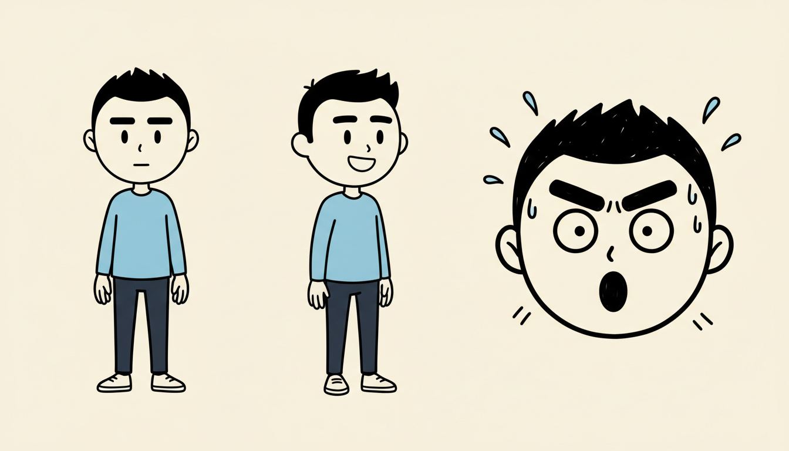
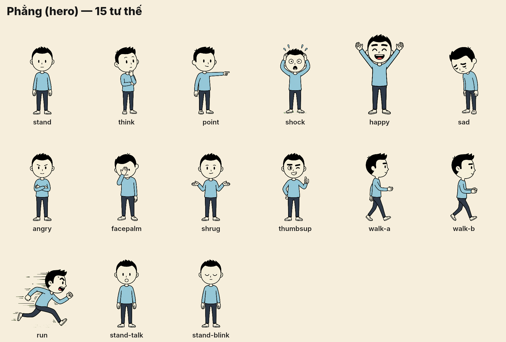
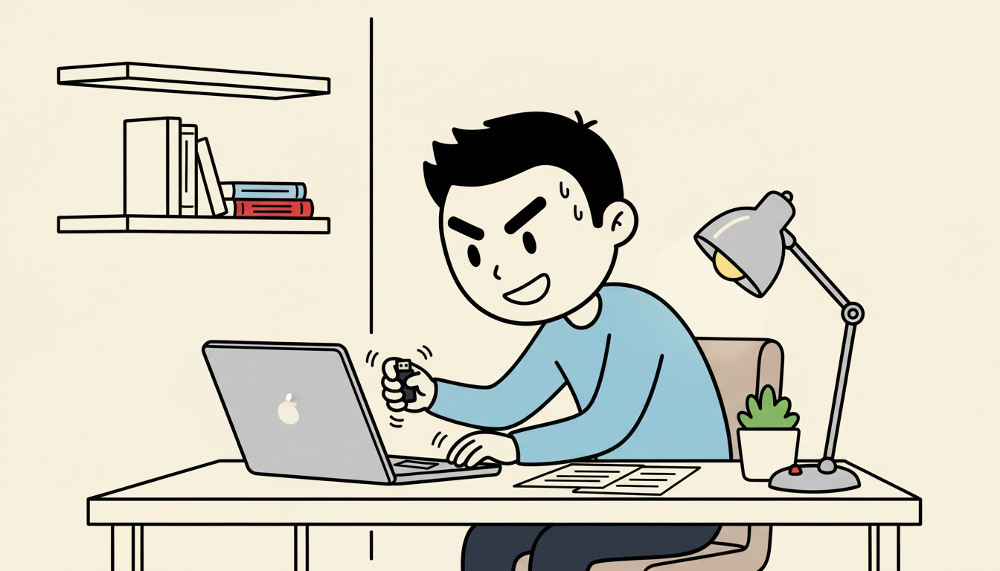
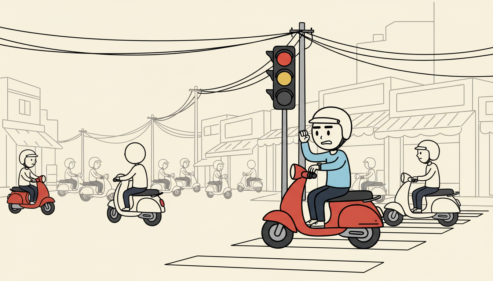

# Phong cách hình ảnh: kênh Não Phẳng

Mọi ảnh, nhân vật, cảnh và overlay đều phải theo file này. Claude Code: đọc file này và xem các ảnh mẫu bên dưới trước khi viết prompt ảnh hoặc code scene.

## Ảnh mẫu (trong repo)

| Ảnh | Dùng để |
|---|---|
|  | **Nhân vật chính "Phẳng"**: thiết kế chuẩn. Luôn gửi ảnh này làm reference khi tạo ảnh có nhân vật. |
|  | Bộ tư thế hiện có (`characters/hero/poses/*.png`, nền trong suốt). |
|  | Ví dụ cảnh trong nhà: đường nét phối cảnh đơn giản, nhiều khoảng trống. |
|  | Ví dụ cảnh ngoài phố: chi tiết vẽ nét mảnh, màu rất ít. |

Ảnh tham khảo của bên thứ ba (thumbnail các kênh khác) **không** đưa lên repo vì có bản quyền và repo đang public. Nếu có, chúng nằm ở `docs/style/private/` (đã gitignore, chỉ có trên máy). Claude Code local có thể mở thư mục này để tham khảo cảm giác, nhưng **không sao chép** nhân vật hay bố cục.

## Quy tắc

- **Nét:** mực đen đậm, hơi run tay, viền dày đều. Không gradient, gần như không đổ bóng.
- **Màu:** nền giấy kem `#f6eedc`, mực `#151515`, trắng ngà cho da. Áo nhân vật chính xanh nhạt `#8cc4e4`, quần navy `#2b3445`. Điểm nhấn đỏ `#e0362c` dùng rất ít (chữ tiêu đề, dấu !, mũi tên).
- **Nhân vật:** đầu tròn to (khoảng 1/3 chiều cao), mắt chấm, lông mày dày biểu cảm, mũi nét cong nhỏ, tay chân mảnh. Biểu cảm phóng đại kiểu hài: giọt mồ hôi, đường sốc, dấu hỏi.
- **Cảnh:** tường và sàn chỉ là vài đường thẳng phối cảnh, nhiều khoảng trống để đặt chữ và icon.
  **Không vẽ nhân vật vào ảnh nền.** Nhân vật được ghép riêng bằng bộ tư thế, để animate và dùng lại.
- **Chữ trên hình:** do code vẽ (Inter ExtraBold), không để AI vẽ chữ. Tiêu đề kiểu thumbnail: một từ đỏ, phần còn lại đen.
- **Cấm:** ảnh chân thực, 3D, anime, gradient, logo hoặc thương hiệu thật (kể cả logo Apple trên laptop), watermark.

## Prompt mẫu

Câu mô tả chung nằm ở `src/config/style.ts`, gồm `STYLE` và `CHARACTER`.
- Nền không có nhân vật: thêm `no people, no characters, empty scene`.
- Bộ tư thế: dùng `scripts/gen-character.ts`. Script luôn gửi kèm `hero-model-sheet.png` và yêu cầu nền xanh trơn để tách nền.
